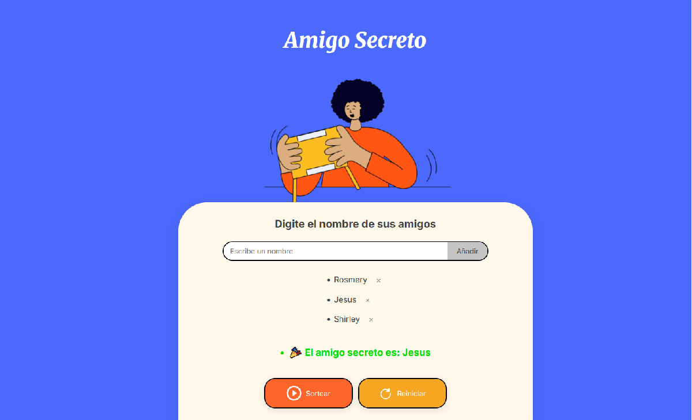

# 🎁 Amigo Secreto

¡Bienvenido/a al juego interactivo del **Amigo Secreto**!  
Una aplicación web sencilla y divertida para organizar un sorteo entre tus amigos y descubrir quién regala a quién 🎉

---

## 📸 Vista previa y click a la imagen si deseas jugar

[](https://challenge-amigo-secreto-d526kvglh-datamasterdevs-projects.vercel.app/)

---

## 🚀 Funcionalidades

- 🎲 Sorteo aleatorio entre participantes.
- 📝 Agregar y eliminar nombres de forma interactiva.
- ✅ Validaciones de entrada (sin duplicados, sin caracteres inválidos).
- ⌨️ Añadir con Enter y enfoque automático en el input.
- 💡 Interfaz intuitiva y responsive para todos los dispositivos.
- 🔄 Reinicio del sorteo para volver a empezar.

---

## 🛠️ Tecnologías utilizadas

| Tecnología | Uso |
|------------|-----|
| `HTML5`    | Estructura general del sitio |
| `CSS3`     | Estilos y diseño responsive |
| `JavaScript (ES6+)` | Lógica del juego y validaciones |
| `Google Fonts` | Tipografías personalizadas |

---

## 🧩 Estructura del proyecto

📁 juego-secreto/   
├── index.html `Interfaz principal`    
├── style.css   `Estilos personalizados`     
├── app.js `lógica del juego`  
├── README.md `Documentación del proyecto`  
   
---
## 🔗 Accede al juego
Puedes jugar directamente desde este enlace:  
  
➡ **[Juego Secreto en Vercel](https://challenge-amigo-secreto-nine-psi.vercel.app/)**
---
## 🧪 Cómo usarlo

1. Cloná el repositorio:

   ```sh
   git clone https://github.com/datamasterdev/juego-secreto.git
Abrí index.html en tu navegador.

Escribí los nombres de los participantes (mínimo 3), hacé clic en Añadir o presioná Enter.

Cuando termines, hacé clic en Sortear y descubrí al amigo secreto 🎉

Si querés empezar de nuevo, usá el botón Reiniciar.

📱 Responsive
El juego se adapta automáticamente a dispositivos móviles, tablets y pantallas grandes.

🧠 Extras técnicos
El input tiene enfoque automático al cargar la página.

El botón de añadir también se activa con la tecla Enter.

La alerta personalizada mejora la experiencia cuando hay errores o validaciones.

🤝 Contribuciones
¡Las contribuciones son bienvenidas!
Podés hacer un fork del proyecto, crear una rama y enviar un pull request con tus mejoras 🚀

✨ Autor
Desarrollado con 💙 por [JESUS GIL VARGAS]
